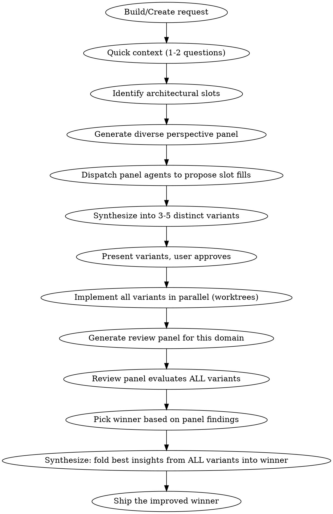

# Jam

Parallel exploration framework powered by diverse perspectives. Instead of one mind generating options and picking a winner, Jam dispatches independent agents with different worldviews to both **propose approaches** and **evaluate implementations**, then **synthesizes the best of everything** into the final result.

**The jam was all of us together.**

## Why This Exists

A single agent generating "multiple approaches" is still one mind imagining what different people would think. The perspectives cluster, biases leak through, and the agent converges to its own preference. Jam makes diversity real by dispatching independent agents who reason separately.

## When to Use

- "Build X", "Create Y", "Implement Z" — any build/create request where approaches vary
- Architectural decisions with genuine trade-offs
- User shows indecision ("not sure", "either works", "you pick")
- Explicitly requested ("jam", "diverse approaches", "explore options")

## When NOT to Use

- Trivial changes (rename, config tweak, small bugfix)
- User already has a specific approach in mind
- Single clear path with no meaningful alternatives

## The Flow



## Phase 1: Context & Slots

Gather just enough context to understand the problem space. Ask 1-2 questions max.

Identify **architectural slots** — decisions where multiple approaches are genuinely viable:

| Type | Examples | Worth exploring? |
|------|----------|------------------|
| **Architectural** | Storage engine, framework, auth method, API style, rendering strategy | Yes |
| **Trivial** | File location, naming conventions, config format | No |

Only architectural decisions become slots. Cap at 2-3 slots to avoid combinatorial explosion.

## Phase 2: Diverse Perspective Panel (Slot Generation)

**This is what makes Jam different from plain brainstorming.**

### How to Build the Panel

Analyze the domain and generate 3-6 personas with **genuinely different worldviews** about the problem. These are NOT pre-defined templates — they emerge from the specific problem being solved.

**Rules for good panels:**
- Each persona must have a **different optimization function** (what they value most)
- Personas should span beyond just developer archetypes — include end-users, operators, business stakeholders, domain experts as appropriate
- Each persona needs a name, a 1-2 sentence worldview, and what they'd optimize for
- The panel should produce **genuine disagreement**, not polite variations of the same idea

**Example — building a bookmark CLI tool:**
- **Marina, the sysadmin**: Values composability and Unix philosophy. Optimizes for piping, scripting, and working with existing tools.
- **Dev, the junior developer**: Values getting started fast. Optimizes for clear docs, simple mental model, forgiving errors.
- **Priya, the data hoarder**: Has 50,000 bookmarks across 15 years. Optimizes for search speed, deduplication, and import/export.
- **Carlos, the ops engineer**: Will deploy this to 200 machines. Optimizes for single-binary distribution, no runtime dependencies, zero config.

**Example — writing a blog post about a developer tool:**
- **Sam, the skeptical HN commenter**: Has seen 100 tools like this. Optimizes for "why should I care" and "what's actually different."
- **Jordan, the target user**: Actively has the problem this tool solves. Optimizes for "does this solve MY problem" and "how fast can I try it."
- **Alex, the technical writer**: Values clarity and structure. Optimizes for scanability, accurate claims, and working examples.
- **Riley, the busy engineering manager**: Skims everything. Optimizes for "can I forward this to my team with a one-line summary."

### Dispatch Pattern

Present the panel to the user for approval. They can add, remove, or adjust personas.

Then dispatch ALL panel agents in a **single message** using background agents:

```
Agent(persona-1, run_in_background: true, prompt="You are [NAME]... propose how to approach [SLOTS]...")
Agent(persona-2, run_in_background: true, prompt="You are [NAME]... propose how to approach [SLOTS]...")
...all in one message block...
```

Each agent receives:
- Their persona (name, worldview, optimization function)
- The problem description and architectural slots
- Instruction to propose their preferred approach for each slot with reasoning
- **No visibility into other agents' proposals** — independence is critical

### Agent Prompt Structure

```
You are [NAME], [DESCRIPTION].
[1-2 sentences about your worldview and what you optimize for.]

A user wants to [PROBLEM DESCRIPTION].

The key architectural decisions are:
- [SLOT 1]: [options or open-ended]
- [SLOT 2]: [options or open-ended]

Propose YOUR preferred approach. For each decision:
1. What you'd choose and why (from YOUR perspective)
2. What risks you see with other approaches
3. What you'd want to verify before committing

Be opinionated. Don't hedge. Advocate for what YOU believe is right.
```

### Synthesizing Proposals into Variants

After all panel agents return, synthesize their proposals into 3-5 **distinct variants**:

1. Group proposals by fundamental approach (agents with similar worldviews may converge)
2. Each variant should represent a genuinely different philosophy, not just a parameter tweak
3. Name variants by their core philosophy (e.g., "minimal-unix", "data-first", "ops-friendly") not by index
4. Present variants to the user with a summary of which personas drove each one
5. **Max 5-6 variants.** If there are more, identify the primary axis and group.

## Phase 3: Parallel Implementation

For each approved variant:

### Setup

1. Create a git worktree per variant:
   ```bash
   git worktree add .worktrees/variant-<slug> -b jam/<feature>/variant-<slug>
   ```
2. Ensure `.worktrees/` is in `.gitignore`

### Dispatch

Dispatch ALL implementation agents in a **single message** for true parallelism:

```
Agent(variant-1, run_in_background: true, isolation: "worktree", prompt="Implement variant-1...")
Agent(variant-2, run_in_background: true, isolation: "worktree", prompt="Implement variant-2...")
...all in one message block...
```

Each agent receives:
- The variant's philosophy and approach
- The relevant persona proposals that drove this variant
- Full implementation instructions
- Instruction to write tests first (TDD)
- Instruction to report: summary, test counts, files changed, issues encountered

### Directory Structure

```
docs/plans/<feature>/
  context.md                   # Problem description and slots
  panel/
    personas.md                # The perspective panel used
    proposals/                 # Raw proposals from each persona
  variants/
    variant-<slug>/
      approach.md              # Variant philosophy and design
    result.md                  # Final comparison and winner

.worktrees/
  variant-<slug>/              # Implementation worktrees
```

## Phase 4: Review Panel Evaluation

**Do NOT evaluate from a single perspective.** Generate a new review panel appropriate for the domain.

### Generate the Review Panel

Just like Phase 2, the review panel is **domain-specific and dynamically generated**. Analyze what matters for THIS project and create reviewers accordingly.

**Rules:**
- Reviewers should cover different evaluation angles (not just code quality)
- Mix code reviewers with user-perspective reviewers where appropriate
- If a running dev server exists, some reviewers should interact with the actual product via browser
- Each reviewer gets access rules (can they read code? only use the product? both?)
- **Balance measurable and subjective criteria.** Panels naturally skew toward things that are easy to score (correctness, compliance, performance) and away from things that require taste (aesthetics, emotional impact, delight). If the output has a subjective dimension that matters, make sure someone on the panel is optimizing for it — not just checking boxes.

**Example review panel for a CLI tool:**
- **Code quality reviewer**: Reads source code. Checks architecture, error handling, test coverage.
- **First-time user**: Uses the tool cold with only the README. Reports confusion and friction.
- **Power user**: Tries advanced workflows, piping, scripting, edge cases.
- **The migrator**: Tries to import/export data, checks data portability.

**Example review panel for a blog post:**
- **The target reader**: Reads cold. Reports what they understood and what they'd do next.
- **The editor**: Checks structure, flow, clarity, claims accuracy.
- **The skeptic**: Looks for weak arguments, unsupported claims, missing counterpoints.

### Present & Approve

**Present the review panel to the user before dispatching** — same as Phase 2. User can add, remove, or adjust reviewers. Do NOT skip this step.

### Dispatch Pattern

Dispatch all reviewers against **each variant**. If reviewers need browser access, run them sequentially per variant. Code-only reviewers can run in parallel.

Each reviewer reports:
- Findings ranked by severity
- What this variant does **well** (critical for synthesis later)
- What this variant does **poorly**
- Comparison notes if they've reviewed multiple variants

### Consolidate & Pick Winner

Compile findings into a cross-variant comparison:

```markdown
## Jam Evaluation: <feature>

### Variant Scorecard

| Criterion | variant-a | variant-b | variant-c |
|-----------|-----------|-----------|-----------|
| [Reviewer 1 focus] | findings | findings | findings |
| [Reviewer 2 focus] | findings | findings | findings |
| Tests passing | Y/N | Y/N | Y/N |

### Per-Variant Strengths (PRESERVE THESE FOR SYNTHESIS)

**variant-a:** [what reviewers loved]
**variant-b:** [what reviewers loved]
**variant-c:** [what reviewers loved]

### Per-Variant Weaknesses

**variant-a:** [what reviewers flagged]
**variant-b:** [what reviewers flagged]
**variant-c:** [what reviewers flagged]

### Winner: variant-X
[Why, based on panel findings]
```

**Elimination rules:**
- Fails tests → eliminated
- Critical issues from reviewers → eliminated
- All fail → report to user, ask how to proceed

## Phase 5: Synthesis

**This is the phase that makes Jam more than a competition.**

The losing variants are not waste — they are learning. The review panels identified what EACH variant did well. Now fold the best insights into the winner.

### What to Synthesize

Go through every "strength" flagged by reviewers for losing variants:

1. **Directly portable improvements**: A losing variant had better error messages, a cleaner API for one endpoint, a smarter caching approach. Port it.
2. **Design insights**: A losing variant's approach to one sub-problem was better even though its overall approach lost. Extract the pattern and apply it.
3. **Reviewer feedback applicable to winner**: A reviewer flagged something missing in ALL variants. Fix it in the winner.

### What NOT to Synthesize

- Don't frankenstein the winner into a mess. Each incorporation must be justified.
- Don't import the losing variant's core architecture — it lost for a reason.
- Don't add complexity that contradicts the winner's philosophy.
- If incorporating something would require major refactoring, note it as a future option rather than forcing it in.

### Synthesis Process

1. List all strengths from losing variants (from Phase 4 findings)
2. For each, assess: Can this improve the winner without contradicting its philosophy?
3. Present the synthesis plan to the user for approval
4. Implement the approved improvements in the winner's branch
5. Run tests again to verify nothing broke

### Write result.md

```markdown
# Jam Results: <feature>

## Perspective Panel
[Who proposed approaches and why]

## Variants Explored
| Variant | Philosophy | Tests | Result |
|---------|-----------|-------|--------|
| variant-a | ... | PASS | WINNER |
| variant-b | ... | PASS | Insights incorporated |
| variant-c | ... | FAIL | Eliminated |

## Review Panel
[Who evaluated and their key findings]

## Winner: variant-a
[Why it won]

## Synthesis: What We Learned From Everyone
| Source | Insight | Incorporated? | How |
|--------|---------|---------------|-----|
| variant-b | Better error messages | Yes | Ported error handling pattern |
| variant-b | GraphQL subscriptions | No | Over-complex for current needs |
| variant-c | Single-binary deploy | Yes | Adopted static linking approach |
| Reviewer X | Missing input validation | Yes | Added to all endpoints |

## The Jam Was All of Us Together
[Brief narrative of how the final result is better than any single variant]
```

## Phase 6: Cleanup & Finish

1. **Verify** the synthesized winner passes all tests
2. **Cleanup loser worktrees:**
   ```bash
   git worktree remove .worktrees/variant-<slug>
   git branch -D jam/<feature>/variant-<slug>
   ```
3. **Finish the winner branch**: merge, PR, or keep as-is (user's choice)

## Critical Rules

1. **Dispatch ALL parallel agents in a SINGLE message** — multiple Agent tools, one message block
2. **Perspective panels are always domain-specific** — never use hardcoded persona templates
3. **Panel agents must be independent** — no agent sees another's output
4. **Present panels to user before dispatching** — user can adjust
5. **Synthesis is ACTIVE, not a backlog** — improvements get implemented, not just documented
6. **Max 5-6 variants** — more than that is diminishing returns
7. **Always write result.md** — document what was tried, what was learned, what was incorporated

## Common Mistakes

| Mistake | Why it's wrong | Fix |
|---------|---------------|-----|
| One mind imagining multiple perspectives | Perspectives cluster, biases leak through, agent converges to its own preference | Dispatch independent agents who can't see each other |
| Pre-defined persona templates | Generic personas miss domain-specific insights | Generate personas from the problem domain |
| Developer-only perspectives | Misses end-user, ops, business, and domain expert viewpoints | Span beyond developer archetypes |
| Single-perspective evaluation | One evaluator can't escape its own biases | Review panel with independent reviewers |
| Discarding loser insights | Competition produced learning, not just a winner | Active synthesis phase |
| Documenting insights "for later" | "Later" never comes — insights rot in backlogs | Incorporate improvements NOW in the synthesis phase |
| Over-synthesizing | Frankensteining the winner into a mess | Each incorporation must be justified and approved |
| Skipping user approval | User should see panels and synthesis plan before execution | Present and get approval at every gate |
| All-measurable review panels | Panels skew toward checkable criteria (correctness, compliance) and miss subjective qualities (taste, feel, delight) | Ensure the panel covers both measurable and subjective dimensions |

## Red Flags — STOP and Adjust

If you catch yourself doing any of these, you're bypassing Jam's value:

- Generating all variant approaches yourself instead of dispatching panel agents
- Evaluating from a single perspective instead of dispatching review agents
- Picking a winner and moving on without synthesis
- Noting loser insights "for the backlog" instead of actively incorporating them
- Using the same panel template for every project
- Dispatching agents in separate messages (must be single message for parallelism)
- Skipping user approval of panels or synthesis plan
